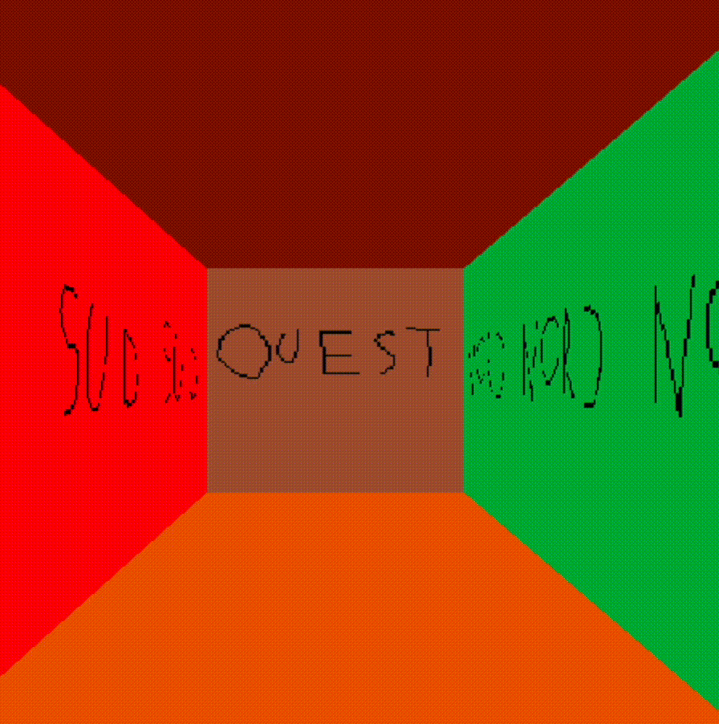

# cub3d

---

## This project introduce you the `raycasting`, a rendering technique to create a 3D perspective in a 2D map popularized by ID Software in 1992 with the famous game : *Wolfenstein 3D* 🔫💪.

---

We can divide this project in four parts : the **parsing**, the **DDA algorithm**, **graphic implementation** and the **the keys detetction**.

## 1. The Parsing 🔨
- <ins>The argument</ins> 💭
Only one argument is allowed with a lot of conditions for being correct : **a VALID map file with the `.cub` extension**.

- <ins>The textures</ins> 🎨
Four texture files must be specified by there `path` and with the **`.xpm` format** : **north `NO`, south `SO`, west `WE` and east `EA`**.
The `floor` and the `ceiling` aren't textures, but a **`RGB` color format**.

- <ins>The map</ins> 🗺️
The map has 3 types of entity represented by a character : `1` is a **wall**, `0` a **free space** where the player can move in, and `N/S/W/E` is the **player with his spawning orientation**.
The map cannot be loaded if the map isn't close, or a `whitespace` is inside it, or even an invalid character is present in the file.

## 2. The DDA algorithm 🧮
Or the **Digital Differential Analyzer** is a simple and efficient method used for rasterization of lines in computer graphics. It calculates the intermediate points of a straight line between two given endpoints and plots those points to draw the line on the screen.
In our case, a fixed value `W_WIDTH` define the width of our windows. This value leads us to define our `FOV`. The `FOV` is arbitrary, it is based on the **trigonometric circle**.

Let's skip the details, in the end we have this result, seen from above:


Dozens of rays/vectors are traced until the impact of a mus with the limit of the self-imposed FOV.
The last step for completing the raycasting is the graphic implementation, **succeed in making the links between calculations and textures**.

## 3. The graphic implementation ✍️
Now, we have everything we need to simulate our 3D in a 2D screen.
We have to calcul the distance of the top of the screen to a wall, knowing this : `The farther we are from a wall, the less wall/ray collisions there are.
The less detail, the smaller the wall.
Finally, the less detailed the wall, the more floor and ceiling`.
Exemple :


Pixels are always drawn from top to step (`+x` to `0`). Then we move on to the next value of y: **the next row of pixels** until we reach the limits of the window, <ins>calculs are always update at every frame</ins>.

##4. The movement and keys detection 🚶‍♂️
The function `mlx_hook` catch keys on the keyboard for *pressing* or *release* it, it's very simple to implement that to the movement of the player.
But this raw method is very low in-game : we **manipulate one octet** a fluid movement.
In our structure, a variable `uint8_t keys` is an empty `int` ( `00000000` ). Each byte represent a key, when the key is pressed, the byte turn `0` to `1`. This modification move the player, and made new calculs for the point of view ( `10000000` ). The movement stop when the `key` is released and the byte return into zero ( `00000000` ).


---

### How to test our program 👾

**First, download maps, textures and minilibx** :
```
make init
```
**Then you can run this to compile :**
```
make && ./cub3D maps/subject.cub
```
You can test other maps present in this directory : `./maps/` or even create your own map and add new textures 😃 !

---

You can remove binary and compiled files :
```
make fclean
```
If you want, you can clean the directory by removing all downloaded files :
```
make fclean_init
```

#ENJOY !

